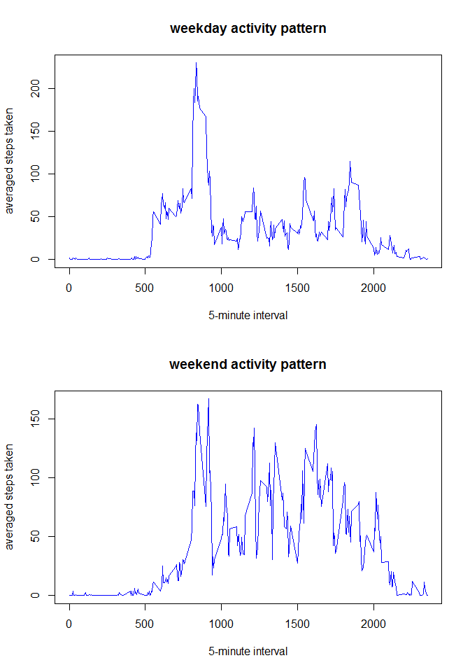

# Reproducible Research: Peer Assessment 1
It is now possible to collect a large amount of data about personal movement using activity monitoring devices such as a Fitbit, Nike Fuelband, or Jawbone Up. These type of devices are part of the "quantified self" movement -- a group of enthusiasts who take measurements about themselves regularly to improve their health, to find patterns in their behavior, or because they are tech geeks. But these data remain under-utilized both because the raw data are hard to obtain and there is a lack of statistical methods and software for processing and interpreting the data.

This assignment makes use of data from a personal activity monitoring device. This device collects data at 5 minute intervals through out the day. The data consists of two months of data from an anonymous individual collected during the months of October and November, 2012 and include the number of steps taken in 5 minute intervals each day

## Loading and preprocessing the data

Reading the .csv file into "data" dataset.


```r
data_csv <- read.csv(file="activity.csv")
# deleting Na values
data <- data_csv[!is.na(data_csv$steps),]
summary(data)
```

```
##      steps                date          interval     
##  Min.   :  0.00   2012-10-02:  288   Min.   :   0.0  
##  1st Qu.:  0.00   2012-10-03:  288   1st Qu.: 588.8  
##  Median :  0.00   2012-10-04:  288   Median :1177.5  
##  Mean   : 37.38   2012-10-05:  288   Mean   :1177.5  
##  3rd Qu.: 12.00   2012-10-06:  288   3rd Qu.:1766.2  
##  Max.   :806.00   2012-10-07:  288   Max.   :2355.0  
##                   (Other)   :13536
```


## What is mean total number of steps taken per day?
Calculating the total steps per day

```r
require(plyr)
```

```
## Loading required package: plyr
```

```r
steps <- ddply(data,.(date),summarize,total = sum(steps))
```

1. histogram of the total number of steps taken each day

```r
hist(steps$total, col= "red",main = "Histogram total steps each day", xlab= "Steps each day")
```

 

2.  The mean and median total number of steps taken per day


```r
#Calculating the mean
mean(steps$total)
```

```
## [1] 10766.19
```

```r
#Calculating the median
median(steps$total)
```

```
## [1] 10765
```


## What is the average daily activity pattern?

```r
#Calculating the mean activity per day
activity <- ddply(data,.(interval),summarize,steps = mean(steps))
```


1. Series plot  of the 5-minute interval and the average number of steps taken, averaged across all days


```r
plot(activity$interval,activity$steps, type = "l", 
     col = "blue", main = "Daily activity pattern", 
     xlab = "5-minute interval", ylab="averaged steps taken")
```

 

2. Which 5-minute interval, on average across all the days in the dataset, contains the maximum number of steps?


```r
activity[activity$steps == max(activity$steps),]
```

```
##     interval    steps
## 104      835 206.1698
```


## Imputing missing values
1. Calculate and report the total number of missing values in the dataset 

```r
na_values <- data_csv[is.na(data_csv$steps),]
nrow(na_values)
```

```
## [1] 2304
```

2. Filling in all of the missing values in the dataset
Strategy: fill the missing value with the mean of steps taken in the same 5-minute interval (from "activity" dataset).


```r
dataNoNA <- data_csv 
rows <- as.numeric(nrow(data_csv))
for(i in 1:rows) {
        if(is.na(data_csv[i,1])) {
                dataNoNA[i,1] <- activity[activity$interval == dataNoNA[i,3],2]
        }
}
```

3. Creating new dataset named dataNoNA.

```r
summary(dataNoNA)
```

```
##      steps                date          interval     
##  Min.   :  0.00   2012-10-01:  288   Min.   :   0.0  
##  1st Qu.:  0.00   2012-10-02:  288   1st Qu.: 588.8  
##  Median :  0.00   2012-10-03:  288   Median :1177.5  
##  Mean   : 37.38   2012-10-04:  288   Mean   :1177.5  
##  3rd Qu.: 27.00   2012-10-05:  288   3rd Qu.:1766.2  
##  Max.   :806.00   2012-10-06:  288   Max.   :2355.0  
##                   (Other)   :15840
```

4. Histogram of the total number of steps taken each day and Calculate and report the mean and median total number of steps taken per day


```r
steps2 <- ddply(dataNoNA,.(date),summarize,total = sum(steps))
hist(steps2$total, col= "red",main = "Histogram total steps each day", xlab= "Steps each day")
```

 

```r
#Calculating the mean
mean(steps2$total)
```

```
## [1] 10766.19
```

```r
#Calculating the median
median(steps2$total)
```

```
## [1] 10766.19
```

comparing with the previous result:
2.  The mean and median total number of steps taken per day


```r
#Previous Mean
mean(steps$total)
```

```
## [1] 10766.19
```

```r
#Previous  median
median(steps$total)
```

```
## [1] 10765
```

## Are there differences in activity patterns between weekdays and weekends?
1. Create a new factor variable in the dataset with two levels -- "weekday" and "weekend" indicating whether a given date is a weekday or weekend day.

```r
dataNoNA$day <- weekdays(as.Date(dataNoNA$date))
rows <- as.numeric(nrow(dataNoNA))
for(i in 1:rows) {
        if((dataNoNA[i,4] == "sábado") | (dataNoNA[i,4] == "domingo")) {
            dataNoNA[i,4] <- "weekend"
        }
        else{
            dataNoNA[i,4] <- "weekday"
        }
}
dataNoNA$day <- as.factor(dataNoNA$day)
```


2. Plot containing a time series plot (i.e. type = "l") of the 5-minute interval (x-axis) and the average number of steps taken, averaged across all weekday days or weekend days (y-axis).

```r
#Calculating the mean activity per day
activity <- ddply(dataNoNA,.(day,interval),summarize,steps = mean(steps))

par(mfrow = c(2, 1))

#plotting weekday activity
with(subset(activity,day == "weekday"),
plot(interval,steps, type = "l", 
     col = "blue", main = "weekday activity pattern", 
     xlab = "5-minute interval", ylab="averaged steps taken"))

#plotting weekend activity
with(subset(activity,day == "weekend"),
plot(interval,steps, type = "l", 
     col = "blue", main = "weekend activity pattern", 
     xlab = "5-minute interval", ylab="averaged steps taken")) 
```

 
